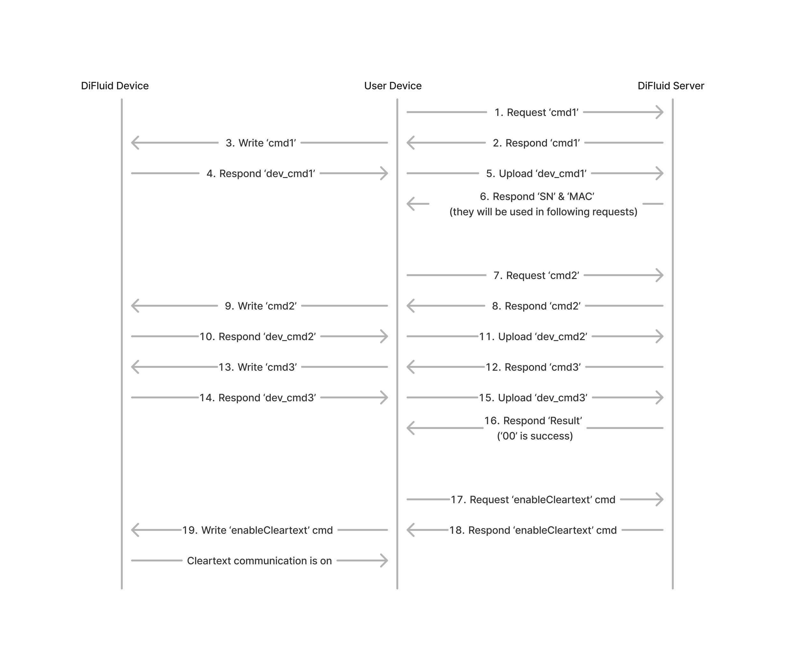

# DiFluid SDK DEMO

### **Introduction**

This is a project demonstrate the usage of SDK protocol on DiFluid serires products.

Here includes the code for the following devices
- [R2 Extract (Firmware Version >= V212)](/docs/protocolR2.md)
- [Microbalance (Firmware Version >= V300)](/docs/protocolMicrobalance.md)
- [Omni (Firmware Version >= V016)](/docs/protocolOmni.md)

And these are the ones still WIP
- Omni
- Omix

This project is based on vue and implemented uniapp framework for cross-platform.

### **Get Started**
0. Install [npm](https://www.npmjs.com/package/npm) and [HbuilderX](https://www.dcloud.io/hbuilderx.html)
1. run `npm install` under the project directory.
2. Replace the key in [config.js](/config.js) with yours. (Contact ethan.zhou@digitizefluid.com or at [discord server](https://discord.gg/FWVcRFyDe4) for the internal test key now)
3. Start HbuilderX:
   - Import project
   - Run - Mobile App Playground

### **Protocol Explanation**
DiFluid devices are built with customized transmission protocols, you will need to go through a preparation procedure before opening up the cleartext protocol. Here is the workflow after bluetooth connection is established.

#### **STEP1: Create Bluetooth Connection**
This part of work is mainly at [home page](/pages/device.vue), it's a standard procedure to connect any ble devices.
- Search for target devices (according to serviceID)
- Create BLE connection
- Subscribe for all the services

Then you should get two services available in total:
- 0000<mark>ff01</mark>-0000-1000-8000-00805f9b34fb // encrypted channel
- 0000<mark>aa01</mark>-0000-1000-8000-00805f9b34fb // cleartext channel

If you are familiar with how to make this connection under your framework / environment, then you can just skip this part.

#### **STEP2: Create Server Connection (Optional)**
~~DiFluid devices now have the encrypted channel on and the cleartext channel off by default. To enabling the cleartext transmission channel, you need to let device to communicate with difluid server after each power on of the device.~~

DiFluid devices now have the encrypted channel and cleartext channel both on by default. This step now is an optional step and is only used to making connection to DiFluid Server and enabling OTA function (WIP for third-party usage).

It may seems complicated, but the main principle is just write the cmd from server into device and return the respond content from device to server. Your client is just behavior like a message relay station.

This part of code is mainly at [r2Detail.vue](/pages/r2Detail.vue), the workflow is shown as below.

#### **STEP3: Decode the data**
Now you can switch to the cleartext service channel, send the action and decode the result. Here is the table for all the available actions and results for every difluid devices supports SDK.

You can refer to the [protocol documents](/docs/difluid-protocol.md) for details and examples.

### **Other references**
This project is mainly written under vue & js and not using the native system features, we are looking for any other third-party demo or well-maintained project to have their links here.
